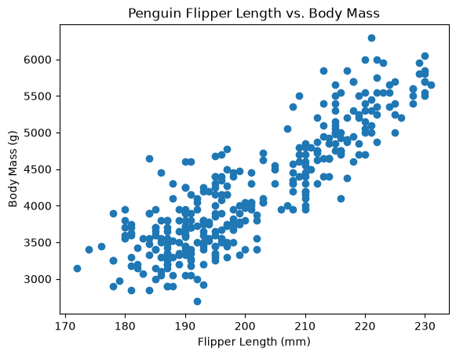
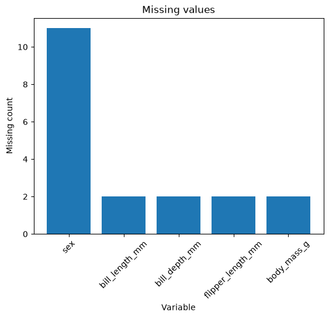

# datafun-04-eda

[](https://denisecase.github.io/pro-analytics-02/workflow-b-apply-example-project/)
[](./pyproject.toml)
[](https://docs.astral.sh/uv/)
[](https://docs.astral.sh/ty/)
[](https://docs.astral.sh/ruff/)
[](https://jupyter.org/)
[](https://docs.marimo.io/)
[](https://zensical.org/)
[](./LICENSE)

> Professional Python project: exploratory data analysis
> including marimo and Jupyter notebooks.

Notebooks combine narration and code.
This project conducts an EDA using Python and also demonstrates
two notebook options:

- **marimo** - a reactive Python notebook that can run as an interactive app
- **Jupyter** - a widely used notebook format for interactive data analysis

Note: With marimo, analysts can build interactive web apps!
It's a whole new skill set, and not easy, but it does create
engaging reports that showcase your analytic skills.

## Motivation

When analysts receive a new dataset,
they need to get to know it before deciding what questions it can answer.
We look through the data, check its quality,
examine how values are distributed, compare groups, and
investigate patterns that might be interesting.

In this project, we'll develop a repeatable way to explore a new dataset.
We'll also use notebooks and interactive tools
that let us combine Python, visualizations, results,
and our own observations as we investigate the data.

## This Project

This project introduces **Exploratory Data Analysis (EDA)** using notebooks.

When we encounter a new dataset, we want to explore quickly:
run checks, view distributions, identify missing values or outliers.
Notebooks combine Markdown narrative with Python code cells
and are ideal for this kind of investigation.

You will run the example notebook, read the code and narrative,
and create your own project to explore a tabular dataset.

## Produced Artifacts

This project produces the same EDA work in several useful forms.

- [**Reactive EDA App (marimo)**](https://delfinasandoval.github.io/datafun-04-eda/app/)
  - run the analysis interactively in a browser

- [**Reactive EDA Notebook (marimo)**](./src/datafun/notebook.py)
  - view the Python source used to create the reactive app

- [**Jupyter Notebook**](./notebooks/eda.ipynb)
  - view the analysis in the traditional notebook format

## Initial Results





## Important Folders and Files

- **docs/** - the project narrative and documentation
- **src/datafun** - Python code and marimo notebook
- **notebooks/** - Jupyter notebook analysis
- **zensical.toml** - update authorship & links

## Common Workflow

Follow the
[step-by-step workflow guide](https://delfinasandoval.github.io/pro-analytics-02/workflow-b-apply-example-project/)
carefully.

## Challenges

Challenges are expected.
Sometimes instructions may not quite match your operating system.
When issues occur, share screenshots, error messages,
and details about what you tried.
Working through issues is part of implementing professional projects.

## Success

After completing Phase 1. **Start & Run**, you'll have the example project,
running on your machine.
A new file `project.log` will appear in the root project folder
and running the example script will print out:

```shell
===================================
END main() - Executed successfully!
===================================
```

## Command Reference

The commands below are used in the workflow guide above.
They are provided here for convenience.

Follow the guide for the **full instructions**.

<details>
<summary>Show command reference</summary>

### In a machine terminal (open in your `Repos` folder)

Open a machine terminal in your `Repos` folder:

```shell
git clone https://github.com/sandoval9713/datafun-04-eda

cd datafun-04-eda
code .
```

### In a VS Code terminal

These are listed for convenience.
For best results, follow the detailed instructions in
[pro-analytics-02 guide](https://delfinasandoval.github.io/pro-analytics-02/).

Use VS Code menu option `Terminal` / `New Terminal` to open a **VS Code terminal**
in the root project folder.
Copy each command, paste into your terminal, and hit ENTER,
to run each command one at a time.

```shell
uv self update
uv python pin 3.14

uv python install
uv lock --upgrade
uv sync

uv run pre-commit install
uv run pre-commit autoupdate

git add -A
uv run pre-commit run --all-files
# repeat if changes were made by pre-commit tasks
git add -A
uv run pre-commit run --all-files

# run the Python module
uv run python -m datafun.app

# run marimo nb as a reactive app
# press Ctrl + C in the terminal to exit
uv run marimo run src/datafun/notebook.py

# Or: run marimo nb as a notebook
uv run marimo edit src/datafun/notebook.py

# Also: See notebooks/ for Jupyter notebooks

# do chores
uv run ruff format .
uv run ruff check . --fix
uv run ty check
uv run python -m pytest
uv run python -m zensical build

# save progress as you work
git add -A
git commit -m "your message here"
# repeat if changes were made (try the UP ARROW)
git add -A
git commit -m "your message here"

git push -u origin main
```

</details>

## Helpful Tips

- Use the **UP ARROW** and **DOWN ARROW** in the terminal
  to scroll through past commands.
- Use `CTRL+f` to find (and replace) text within a file.

## Much Can Be Ignored

- You do not need to add to or modify `tests/`.
  Tests are recommended and provided for example only.
- Many files are silent helpers.
  [Explore](https://delfinasandoval.github.io/professional-python-project-explainer/)
  as you like, but most files are never touched.
- You do NOT need to understand everything;
  let understanding build over time.

## As Needed

If VS Code does not automatically use the new `.venv` environment:

1. Open the Command Palette (`Ctrl+Shift+P`).
2. Run **Python: Select Interpreter**.
3. Select the interpreter from this project's `.venv` folder.

If VS Code still does not recognize the environment or newly installed tools:

1. Open the Command Palette (`Ctrl+Shift+P`).
2. Run **Developer: Reload Window**.

## Troubleshooting >>>

If you see something like this in your terminal: `>>>` or `...`
You accidentally started Python interactive mode.
It happens.
Press `Ctrl c` (both keys together) or `Ctrl+Z` then `Enter` on Windows.

## Documentation

- [Documentation](https://delfinasandoval.github.io/datafun-04-eda/)

## Data Card

- [Palmer Penguins Data Card](./docs/data-card.md)

## Annotations

- [.annotations/annotations.md](./.annotations/annotations.md)

## Citation

- [CITATION.cff](./CITATION.cff)

## License

This project is licensed under the [MIT License](./LICENSE).
