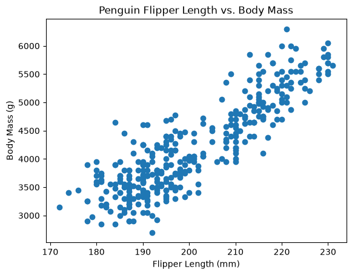
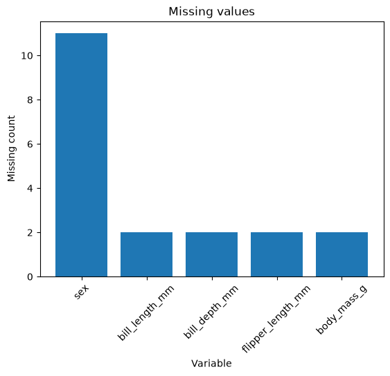

# Project Documentation

# Iris Exploratory Data Analysis
This project explores the Iris dataset using Python and reactive data analysis tools.

## Project Overview
This project applies exploratory data analysis techniques to the Iris dataset.

The analysis focuses on four numeric variables :

- sepal_length
- sepal_width
- petal-length
- petal_width

## Analysis

The Project includes:

- a distribution chart for a selected numeric variable

- interactive X and Y variable selections

- a relationship plot comparing two numeric variables

- reactive updates using Marimo

## Findings
The Iris dataset shows differences in the distributions of flower measurements.
The inseractive relationship chart also makes it possible to compare variables such as sepal length and petal length and observe how the measurements vary together.

## Documentation Index

- **Home** - this landing page
- [**Project Instructions**](./project-instructions.md)
- [**Concepts**](./concepts.md)
- [**Data Card**](./data-card.md)
- [**API**](./api.md)

## Additional Project Pages

- [**Resources**](./resources.md)
- [**Seaborn Datasets**](./seaborn-datasets.md)
- [**Troubleshooting**](./troubleshooting.md)

## Produced Artifacts

- [**Reactive EDA App (marimo)**](./app/)
- [**Reactive EDA Notebook (marimo)**](https://github.com/denisecase/datafun-04-eda/blob/main/src/datafun/notebook.py)
- [**Jupyter Notebook**](https://github.com/denisecase/datafun-04-eda/blob/main/notebooks/eda.ipynb)

## Initial Results

